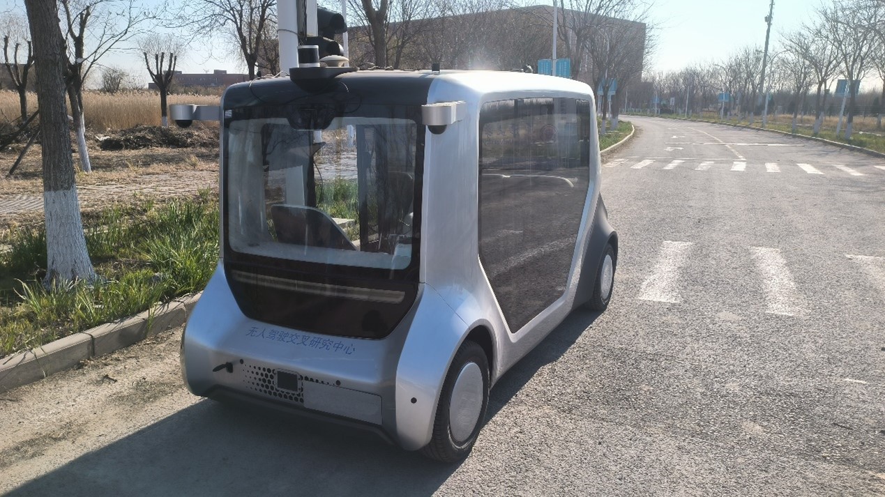
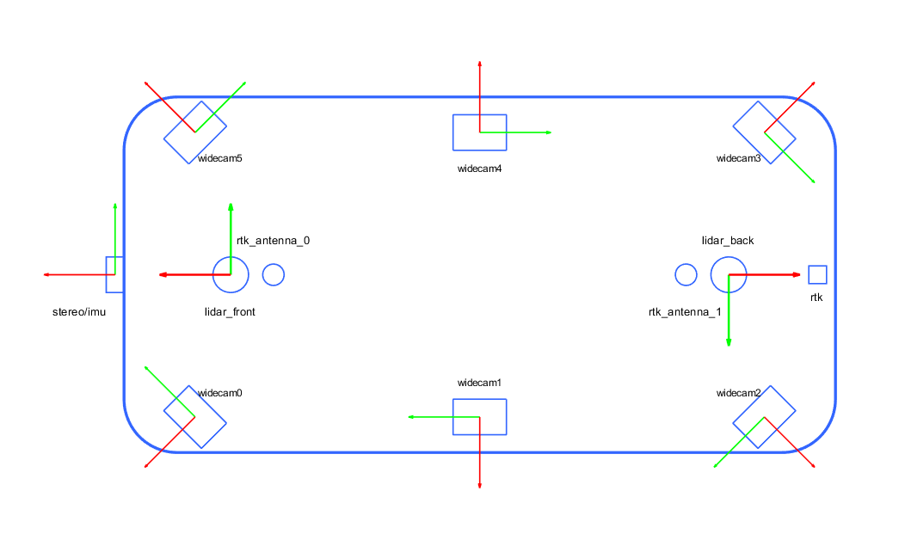
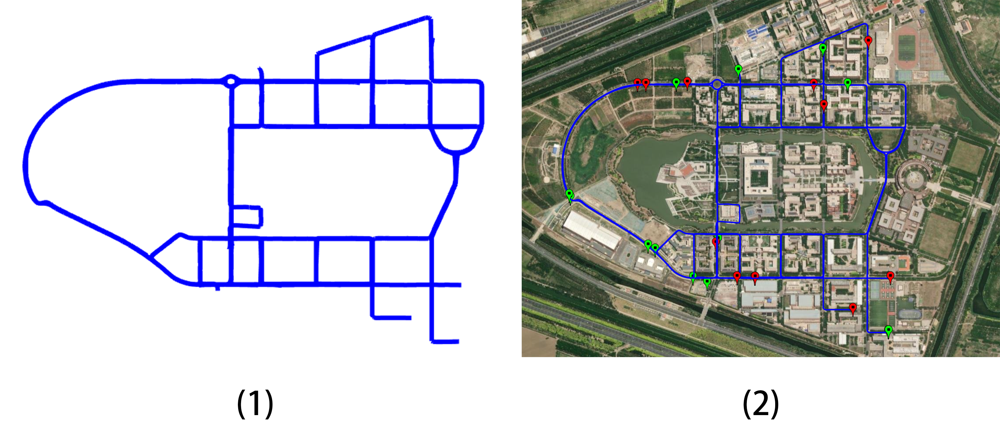
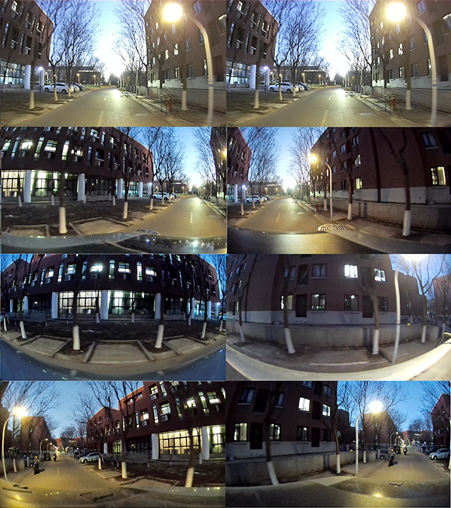
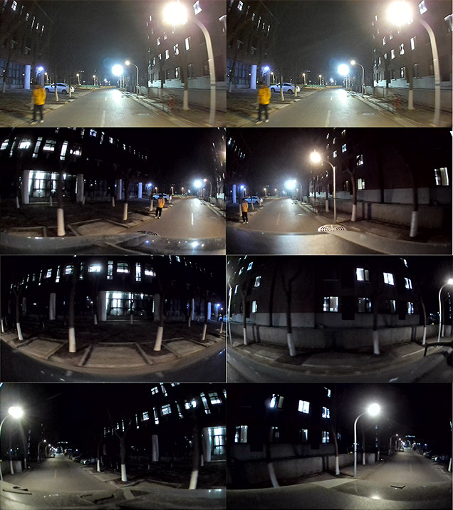
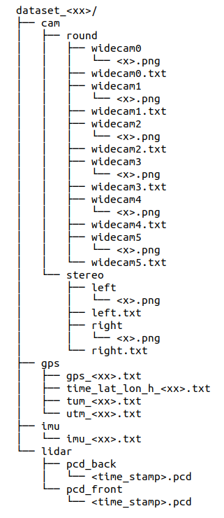

  
   
  <h1>VISTA-Campus: VersatIle SLAM suiTe with All-around Cameras for campus Environment</h1>

In the VISTA-Campus. We have constructed a multi-sensor hardware platform designed to accommodate diverse existing and future perception modalities, thereby addressing limitations in current datasets. Our platform integrates a stereo camera, six wide-angle cameras configured for omnidirectional coverage, two 32-beam LiDAR units, an IMU, and an RTK positioning system. The dataset, collected across campus environments, encompasses data under varying temporal and illumination conditions, diverse pedestrian traffic levels, and distinct scenarios including residential areas and open spaces. It incorporates multiple loop closure detection conditions while providing prolonged and long-distance data sequences, making it particularly suitable for long-term SLAM testing and evaluation. Additionally, we have provided object detection annotations for certain sequences containing densely populated objects.

## Dataset Demo

  <video controls style="max-width: 80%; border-radius: 8px;">
    <source src="your-video.mp4" type="video/mp4">
    Your browser does not support the video tag.
  </video>
  

## Sensor Platform

  <table>
    <tr>
      <td></td>
      <td></td>
    </tr>
    <tr>
      <td align="center">Dataset Collection Equipment</td>
      <td align="center">Sensor Location</td>
    </tr>
  </table>

The entire platform uses a shuttle vehicle controlled by a handle as the mobile device, and all sensors are rigidly connected. The sensors used are as follows:

- **1 ×** Stereolabs Zed mini stereo camera, 480 x 360 x 2, 15Hz, 102°(H) x 57°(V) x 118°(D), 1/3” 4MP CMOS, 3.06mm (0.12”) - f/2.0, Electronic synchronized rolling shutter.
- **1 ×** 6DOF imu in Zed mini.
- **2 ×** Robosense Helios 32 3DLiDARs, 600rpm, 10Hz 360°, 905nm laser wavelength.
- **6 ×** SY011HD-V1 RGBwide-angle cameras, 1920 x 1080 x 6, 10Hz, 2.4mm, 143°(D) x 170°(V).
- **1 ×** CHCNAV CGI-410 integrated navigation system.

## Route

  
  
the track of our dataset. Green markers indicate starting points while red marks denote endpoints.

## Sequence

The complete dataset comprises 13 sequences encompassing variations in illumination conditions, pedestrian/vehicle traffic density, environmental scenarios, sequence durations, and specialized sequences focused on loop closure detection. The detailed sequence classification is shown in the table below.

| Sequence | Time/Light                          | Duration | Distance(km) | Crowded | Scene          | Category |
|----------|-------------------------------------|----------|--------------|---------|----------------|----------|
| 00       | Daytime/Natural Light               | 5'11''   | 1.048        | Y       | Building area  | Common   |
| 01       | Daytime/Natural Light               | 44'04''  | 9.755        | N       | Building area  | Common   |
| 02       | Daytime/Natural Light               | 3'54''   | 0.816        | N       | Open area      | Common   |
| 03       | Dusk/Natural Light & Artificial Light | 6'06''   | 1.003        | Y       | Building area  | Common   |
| 04       | Dusk/Natural Light & Artificial Light | 5'54''   | 1.229        | N       | Building area  | Common   |
| 05       | Dusk/Natural Light & Artificial Light | 4'58''   | 1.078        | N       | Open area      | Common   |
| 06       | Night/Artificial light              | 43'27''  | 9.754        | N       | Building area  | Common   |
| 07       | Night/Artificial light              | 3'03''   | 0.677        | N       | Open area      | Common   |
| 08       | Daytime/Natural Light               | 5'42''   | 1.154        | N       | Building area  | Special  |
| 09       | Daytime/Natural Light               | 4'45''   | 0.955        | N       | Building area  | Special  |
| 10       | Daytime/Natural Light               | 9'46''   | 2.094        | N       | Building area  | Special  |
| 11       | Daytime/Natural Light               | 8'21''   | 1.766        | N       | Building area  | Special  |
| 12       | Daytime/Natural Light               | 4'35''   | 0.886        | N       | Building area  | Special  |

## Lighting Comparison

  <table>
    <tr>
      <td></td>
      <td></td>
      <td></td>
    </tr>
    <tr>
      <td align="center">Daytime example.</td>
      <td align="center">Dusk example.</td>
      <td align="center">Night example.</td>
    </tr>
  </table>

Comparison of different lighting conditions at the same location and time
In the figure, the same location is shown, with a natural light environment during the day (a), a dusk environment with both natural and artificial light sources (b), and a night time environment with only artificial light sources (c). The clarity and visibility of the images captured by the camera will be greatly affected by different light sources at different times.

## File and Data Formats

  

## How to get the data
